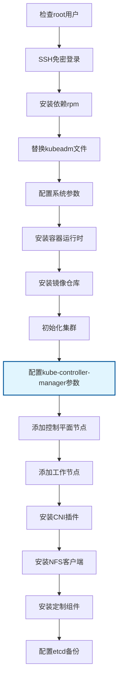

# KubeFoundry 系统对象实体分析

## 一、核心实体分析

### 1. 系统角色实体

#### 1.1 节点 (Node)
- **控制节点 (Controller Node)**
  - 属性：IP地址、主机名、SSH密钥、介质存储路径
  - 行为：分发介质、执行远程脚本、收集结果、生成日志
  - 状态：活跃、离线、错误

- **控制平面节点 (Control Plane Node / Master)**
  - 属性：IP地址、主机名、etcd成员状态、API Server状态
  - 行为：运行etcd、API Server、Controller、Scheduler
  - 状态：Ready、NotReady、维护中

- **工作节点 (Worker Node)**
  - 属性：IP地址、主机名、容器运行时状态、Pod容量
  - 行为：运行业务Pod、加入集群
  - 状态：Ready、NotReady、 cordoned

- **存储节点 (Storage Node)**
  - 属性：IP地址、NFS服务路径、存储容量
  - 行为：提供NFS存储服务
  - 状态：可用、不可用、维护中

#### 1.2 集群 (Cluster)
- **属性**：集群名称、Kubernetes版本、网络CIDR、DNS域名
- **行为**：初始化、扩容、升级、备份、恢复
- **状态**：初始化中、运行中、维护中、错误

### 2. 配置实体

#### 2.1 全局配置 (GlobalConfig)
- **属性**：
  - 介质源路径 (media_source)
  - NAS挂载路径 (nas_mount)
  - 时区 (timezone)
  - SSH配置 (ssh_port, ssh_user, ssh_key_path)
  - 日志级别 (log_level)

#### 2.2 主机清单 (HostInventory)
- **控制平面列表** (ControlPlaneHosts)
  - IP地址、主机名、角色、标签
- **工作节点列表** (WorkerHosts)
  - IP地址、主机名、角色、标签、污点

#### 2.3 包配置 (PackageConfig)
- **属性**：
  - 容器运行时类型 (container_runtime: docker/containerd)
  - Kubernetes版本 (kube_version)
  - CNI插件类型 (cni_type: flannel/calico)
  - 包版本映射 (package_versions)

#### 2.4 镜像仓库配置 (RegistryConfig)
- **属性**：
  - 启用状态 (enabled)
  - 主机地址 (host)
  - 端口 (port)
  - 认证信息 (credentials)
  - 镜像列表 (images)

#### 2.5 存储配置 (StorageConfig)
- **属性**：
  - NFS服务器地址 (server)
  - NFS路径 (path)
  - 存储类名称 (storage_class_name)
  - 回收策略 (reclaim_policy)

#### 2.6 插件配置 (AddonConfig)
- **属性**：
  - 插件列表 (addons: [traefik, prometheus, redis])
  - 插件配置参数 (addon_configs)
  - 启用状态 (enabled)

#### 2.7 控制器配置 (ControllerConfig)
- **属性**：
  - kube-controller-manager启动参数 (controller_manager_args)
  - kube-scheduler启动参数 (scheduler_args)
  - kube-apiserver启动参数 (apiserver_args)
  - 配置文件路径 (config_file_path)

#### 2.8 备份配置 (BackupConfig)
- **属性**：
  - 调度计划 (schedule)
  - 备份路径 (backup_path)
  - 保留策略 (retention_policy)
  - 备份类型 (backup_type)

### 3. 部署流程实体

#### 3.1 部署步骤 (DeploymentStep)
- **属性**：
  - 步骤ID (step_id)
  - 步骤名称 (step_name)
  - 执行顺序 (order)
  - 前置条件 (prerequisites)
  - 验证方法 (validation_method)
  - 回滚方法 (rollback_method)

- **15个具体步骤**：
  1. RootUserValidationStep (检查是否为root用户)
  2. SSHKeyDistributionStep (服务器之间免密登录)
  3. DependencyInstallationStep (检查并安装依赖，rpm安装)
  4. KubernetesInstallationStep (替换kubeadm文件)
  5. SystemConfigurationStep (根据配置参数，配置系统参数)
  6. ContainerRuntimeSetupStep (安装docker/containerd)
  7. RegistryDeploymentStep (安装镜像仓库)
  8. ClusterInitializationStep (初始化集群)
  9. **ControllerManagerConfigStep (kube-controller-manager添加启动参数)** 🆕
  10. ControlPlaneJoinStep (添加控制平面)
  11. WorkerNodeJoinStep (添加工作节点)
  12. CNIInstallationStep (安装cni插件flannel)
  13. NFSProvisionerSetupStep (安装nfs-client-provisioner)
  14. AddonDeploymentStep (安装定制化组件如traefik、prometheus、redis等)
  15. EtcdBackupSetupStep (配置定时备份etcd任务crontab)

#### 3.2 部署状态 (DeploymentState)
- **属性**：
  - 状态ID (state_id)
  - 步骤状态 (step_states)
  - 开始时间 (start_time)
  - 结束时间 (end_time)
  - 错误信息 (error_message)
  - 进度百分比 (progress_percentage)

#### 3.3 控制器管理器配置步骤 (ControllerManagerConfigStep)
- **属性**：
  - 步骤ID (step_id: "controller_manager_config")
  - 配置参数 (config_parameters)
  - Pod清单路径 (pod_manifest_path)
  - 备份原配置 (backup_original_config)
  - 重启策略 (restart_policy)

- **行为**：
  - 备份原有 kube-controller-manager Pod 配置
  - 修改 /etc/kubernetes/manifests/kube-controller-manager.yaml
  - 添加自定义启动参数（如：--horizontal-pod-autoscaler-use-rest-clients=false）
  - 重启 kube-controller-manager Pod
  - 验证配置生效和 Pod 状态

- **验证方法**：
  - 检查 kube-controller-manager Pod 是否正常运行
  - 验证启动参数是否正确加载
  - 检查控制器管理器日志确认参数生效

- **回滚方法**：
  - 恢复备份的原始配置文件
  - 重启 Pod 以应用原配置

#### 3.4 部署任务 (DeploymentTask)
- **属性**：
  - 任务ID (task_id)
  - 配置文件路径 (config_path)
  - 目标节点列表 (target_nodes)
  - 部署步骤列表 (deployment_steps)
  - 当前状态 (current_status)
  - 执行日志 (execution_logs)

### 4. 安全和凭证实体

#### 4.1 SSH密钥对 (SSHKeyPair)
- **属性**：
  - 公钥内容 (public_key)
  - 私钥内容 (private_key)
  - 密钥类型 (key_type: rsa/ed25519)
  - 密钥长度 (key_length)
  - 创建时间 (created_at)

#### 4.2 Kubernetes令牌 (KubernetesToken)
- **属性**：
  - Token值 (token_value)
  - 类型 (token_type: bootstrap/join)
  - 过期时间 (expiration_time)
  - 创建时间 (created_at)
  - 使用次数 (usage_count)

#### 4.3 证书 (Certificate)
- **属性**：
  - 证书内容 (certificate_content)
  - 私钥内容 (private_key_content)
  - CA证书 (ca_certificate)
  - 有效期 (validity_period)
  - 使用用途 (usage_purpose)

### 5. 介质和包实体

#### 5.1 安装介质 (InstallationMedia)
- **属性**：
  - 介质类型 (media_type: rpm/docker_image/yaml)
  - 文件路径 (file_path)
  - 校验和 (checksum)
  - 版本信息 (version)
  - 依赖关系 (dependencies)

#### 5.2 镜像清单 (ImageManifest)
- **属性**：
  - 镜像名称 (image_name)
  - 镜像标签 (image_tag)
  - 镜像大小 (image_size)
  - 校验和 (checksum)
  - 拉取策略 (pull_policy)

#### 5.3 包清单 (PackageManifest)
- **属性**：
  - 包名称 (package_name)
  - 包版本 (package_version)
  - 包架构 (package_architecture)
  - 依赖包列表 (dependencies)
  - 安装路径 (install_path)

### 6. 日志和监控实体

#### 6.1 部署日志 (DeploymentLog)
- **属性**：
  - 日志ID (log_id)
  - 时间戳 (timestamp)
  - 日志级别 (log_level)
  - 节点信息 (node_info)
  - 步骤信息 (step_info)
  - 日志内容 (log_content)

#### 6.2 执行报告 (ExecutionReport)
- **属性**：
  - 报告ID (report_id)
  - 生成时间 (generated_at)
  - 总体状态 (overall_status)
  - 成功步骤数 (successful_steps)
  - 失败步骤数 (failed_steps)
  - 耗时统计 (duration_stats)
  - 错误汇总 (error_summary)

### 7. 备份和恢复实体

#### 7.1 Etcd备份 (EtcdBackup)
- **属性**：
  - 备份ID (backup_id)
  - 备份时间 (backup_time)
  - 备份文件路径 (backup_file_path)
  - 备份大小 (backup_size)
  - 校验和 (checksum)
  - 保留策略 (retention_policy)

#### 7.2 备份策略 (BackupPolicy)
- **属性**：
  - 策略名称 (policy_name)
  - 调度表达式 (schedule_expression)
  - 备份路径 (backup_path)
  - 保留天数 (retention_days)
  - 压缩选项 (compression_options)

## 二、实体关系分析

### 核心关系
1. **集群** 包含多个 **节点**
2. **节点** 可以是控制平面节点或工作节点
3. **部署任务** 在指定 **节点** 上执行 **部署步骤**
4. **配置实体** 指导 **部署任务** 的执行
5. **安装介质** 支持部署流程的执行
6. **备份策略** 定期创建 **Etcd备份**

### 关系类型
- **组合关系**：集群 → 节点
- **依赖关系**：部署步骤 → 前置条件
- **关联关系**：配置 → 部署任务
- **继承关系**：节点 → 控制平面节点/工作节点

## 三、设计模式建议

### 1. 状态模式 (State Pattern)
用于管理 **部署状态** 和 **节点状态** 的转换

### 2. 策略模式 (Strategy Pattern)
用于不同 **部署步骤** 的具体实现

### 3. 命令模式 (Command Pattern)
用于 **部署任务** 的执行和回滚

### 4. 观察者模式 (Observer Pattern)
用于 **日志记录** 和 **状态监控**

### 5. 工厂模式 (Factory Pattern)
用于创建不同类型的 **安装介质**

## 四、数据持久化建议

### 状态文件
- `/var/lib/k8s-autodeploy/state/<step>.done`
- `/root/.k8s-autodeploy/state/`

### 配置文件
- `deploy-config.yaml`
- `manifest.json`

### 凭证存储
- `/root/.k8s-autodeploy/creds/`

### 日志文件
- `/var/log/k8s-autodeploy/<timestamp>-<step>.log`

这种实体分析为后续的脚本设计和配置管理提供了清晰的数据模型基础。

## 五、更新后的配置示例

### 5.1 包含控制器配置的 deploy-config.yaml 示例

```yaml
global:
  media_source: /opt/offline_media
  nas_mount: /mnt/nas/k8s
  timezone: Asia/Shanghai

hosts:
  control_plane:
    - ip: 192.168.1.11
      hostname: master1
    - ip: 192.168.1.12
      hostname: master2
  workers:
    - ip: 192.168.1.21
      hostname: node1

packages:
  container_runtime: containerd
  kube_version: 1.30.14

registry:
  enabled: true
  host: registry.local
  port: 5000

nfs:
  server: 10.0.0.5
  path: /export/k8s

# 🆕 新增：控制器配置
controller:
  kube_controller_manager:
    extra_args:
      - "--horizontal-pod-autoscaler-use-rest-clients=false"
      - "--feature-gates=CSIMigration=true"
      - "--bind-address=0.0.0.0"
    restart_policy: "Always"
  kube_scheduler:
    extra_args:
      - "--bind-address=0.0.0.0"
  kube_apiserver:
    extra_args:
      - "--feature-gates=CSIMigration=true"

addons: [traefik, prometheus, redis]

etcd_backup:
  schedule: "0 2 * * *"
  backup_path: /mnt/nas/etcd-backup
```

### 5.2 新增步骤的流程依赖关系



这个新增的步骤确保了 kube-controller-manager 能够根据特定需求进行定制化配置，同时保持了部署流程的完整性和可靠性。